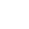

<picture>
  
</picture>

  

### Portfolio (Click Me!)

### Socials

### Favorite Languages

### Others I Like

 

### Best AI Tools

  
  &nbsp;&nbsp;&nbsp;&nbsp;
  

  <strong>Copilot</strong>
  &nbsp;&nbsp;&nbsp;&nbsp;&nbsp;&nbsp;&nbsp;&nbsp;
  <strong>Claude</strong>

 

### Frameworks & Libraries

  
  &nbsp;&nbsp;&nbsp;&nbsp;
  
  &nbsp;&nbsp;&nbsp;&nbsp;
  
  &nbsp;&nbsp;&nbsp;&nbsp;
  
  &nbsp;&nbsp;&nbsp;&nbsp;
  

  <strong>React</strong>
  &nbsp;&nbsp;&nbsp;&nbsp;&nbsp;&nbsp;
  <strong>Redux</strong>
  &nbsp;&nbsp;&nbsp;&nbsp;&nbsp;&nbsp;
  <strong>NodeJS</strong>
  &nbsp;&nbsp;&nbsp;&nbsp;&nbsp;&nbsp;&nbsp;
  <strong>NX</strong>
  &nbsp;&nbsp;&nbsp;&nbsp;&nbsp;&nbsp;&nbsp;&nbsp;&nbsp;
  <strong>NestJS</strong>

  
  &nbsp;&nbsp;&nbsp;&nbsp;
  
  &nbsp;&nbsp;&nbsp;&nbsp;
  
  &nbsp;&nbsp;&nbsp;&nbsp;
  
  &nbsp;&nbsp;&nbsp;&nbsp;
  

  <strong>Astro</strong>
  &nbsp;&nbsp;&nbsp;&nbsp;&nbsp;&nbsp;
  <strong>Django</strong>
  &nbsp;&nbsp;&nbsp;&nbsp;&nbsp;
  <strong>Laravel</strong>
  &nbsp;&nbsp;&nbsp;&nbsp;&nbsp;&nbsp;
  <strong>Unity</strong>
  &nbsp;&nbsp;&nbsp;&nbsp;
  <strong>Unreal Engine</strong>

 
